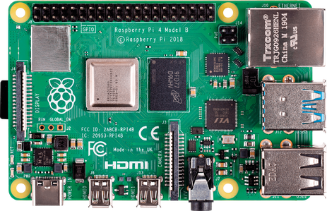
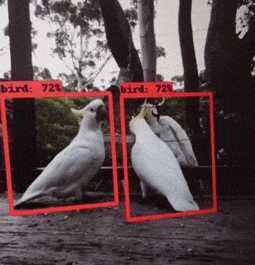

# Bird Watching Robot Project

# Hardware 

## Raspberry Pi 4 Model B 8 GB RAM

A small size fully-functional computer that can be programmed almost in any language, and to which additional hardware can be attached.

## Pi Camera

8-megapixel camera module attached to Raspberry Pi board with the help of a ribbon cable that gives our robot the ability to see. 
Pi Camera is able to provide 1920x1080 pixels resolution for up to a rate of 30 frames per second

## Pan-Tilt HAT 

The HAT and its on-board microcontroller allow independently drive the two servos (pan and tilt). 
The module pans and tilts through 180 degrees in each axis.

# Object Detection and Classification 

## SSD MobileNetV3 Model

MobileNetV3 pretrained on Common Objects in Context (COCO) dataset and converted to TensorFlow Lite (see rpi-deep-pantilt repo). 

In the implementation you can see real-time object detection based on single-shot detector algorithm. 
